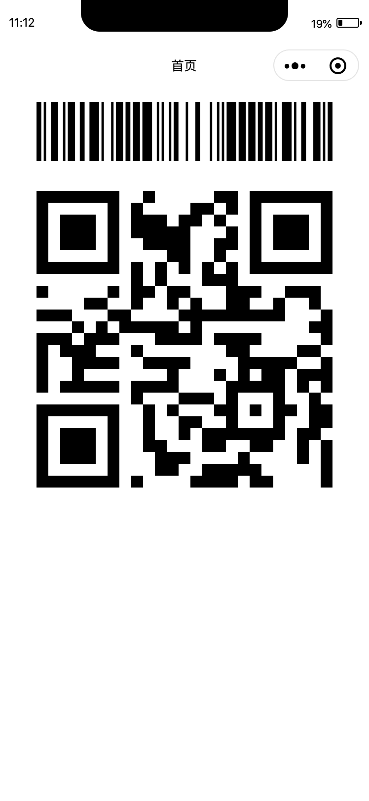

# Taro Code

> QRCode & Barcode component for [Taro](https://taro.js.org) 3.x, inspired by [wx-base64-qrcode](https://github.com/PsChina/wx-base64-qrcode) and [wxbarcode](https://github.com/alsey/wxbarcode). Components will generate base64 qrcode/barcode image.

[Taro 2.x documentation](https://github.com/Miaonster/taro-code/tree/taro-2.x)

## Getting Started

### Install

```
yarn add taro-code
# or
npm install taro-code
```

### Usage

```tsx
import Taro from '@tarojs/taro'
import { Barcode, QRCode } from 'taro-code'

class Code extends Taro.Component {
  render() {
    return (
      <View>
        <Barcode text='hello' width={300} height={60} scale={4} />
        <QRCode text='world' size={300} scale={4} errorCorrectLevel='M' typeNumber={2} />
      </View>
    )
  }
}
```

## Components

### Barcode

| Prop              | Type     | Default   |
| ----------------- | -------- | --------- |
| `text`            | `string` | `''`      |
| `width`           | `number` | `300`     |
| `height`          | `number` | `80`      |
| `scale`           | `number` | `4`       |
| `style`           | `object` | `{}`      |
| `className`       | `string` |           |
| `foregroundColor` | `string` | `#000000` |
| `backgroundColor` | `string` | `#FFFFFF` |

### QRCode

| Prop                | Type                       | Default   |
| ------------------- | -------------------------- | --------- |
| `text`              | `string`                   | `''`      |
| `size`              | `number`                   | `300`     |
| `scale`             | `number`                   | `4`       |
| `typeNumber`        | `number`                   | `2`       |
| `errorCorrectLevel` | `'L' \| 'M' \| 'Q' \| 'H'` | `'M'`     |
| `style`             | `object`                   | `{}`      |
| `className`         | `string`                   |           |
| `foregroundColor`   | `string`                   | `#000000` |
| `backgroundColor`   | `string`                   | `#FFFFFF` |

### ImageProps

除了上述的属性外，还支持 [ImageProps](https://taro-docs.jd.com/taro/docs/components/media/image/#imageprops) 的所有属性， 例如 `showMenuByLongpress` 等。

## API

### createQrCodeImg

生成二维码 Base64 图片数据的工具函数。

**参数：**

```ts
createQrCodeImg(text: string, options?: {
  size?: number
  typeNumber?: number
  errorCorrectLevel?: 'L' | 'M' | 'Q' | 'H'
  black?: string
  white?: string
  padding?: number
}): string
```

| 参数                        | 类型                       | 默认值      | 描述       |
| --------------------------- | -------------------------- | ----------- | ---------- |
| `text`                      | `string`                   | `''`        | 二维码内容 |
| `options.size`              | `number`                   | `500`       | 图片尺寸   |
| `options.typeNumber`        | `number`                   | `4`         | 二维码版本 |
| `options.errorCorrectLevel` | `'L' \| 'M' \| 'Q' \| 'H'` | `'M'`       | 容错级别   |
| `options.black`             | `string`                   | `'#000000'` | 前景色     |
| `options.white`             | `string`                   | `'#FFFFFF'` | 背景色     |
| `options.padding`           | `number`                   | `4`         | 内边距     |

**返回值：**

返回 Base64 格式的 GIF 图片数据字符串，可直接用于 Image 组件的 src 属性。

**示例：**

```tsx
import { createQrCodeImg } from 'taro-code/lib/common/qrcode'

// 基本用法
const imageData = createQrCodeImg('Hello World')

// 自定义样式
const customImageData = createQrCodeImg('Hello World', {
  size: 400,
  errorCorrectLevel: 'H',
  black: '#FF0000',
  white: '#00FF00',
  padding: 20,
})

// 在组件中使用
function MyComponent() {
  const qrImage = createQrCodeImg('https://example.com', {
    size: 300,
    padding: 15,
  })

  return <Image src={qrImage} style={{ width: 150, height: 150 }} />
}
```

## Screenshot


